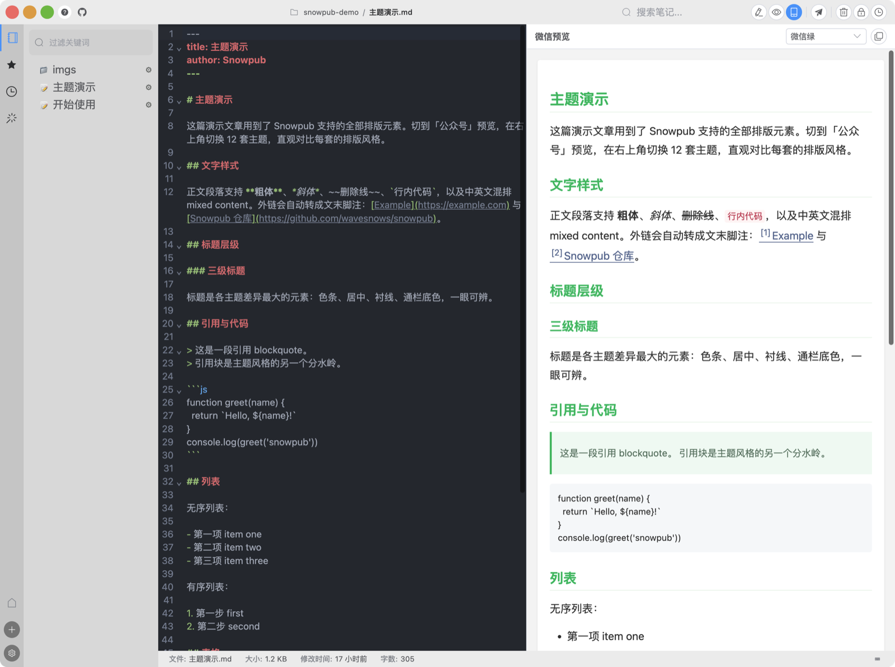
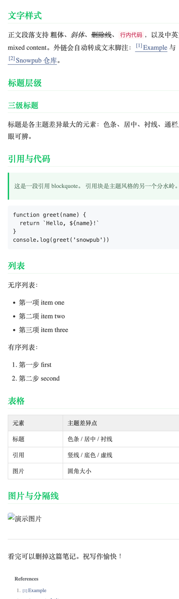
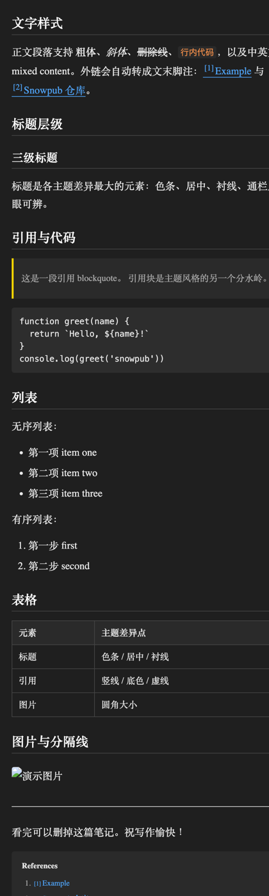
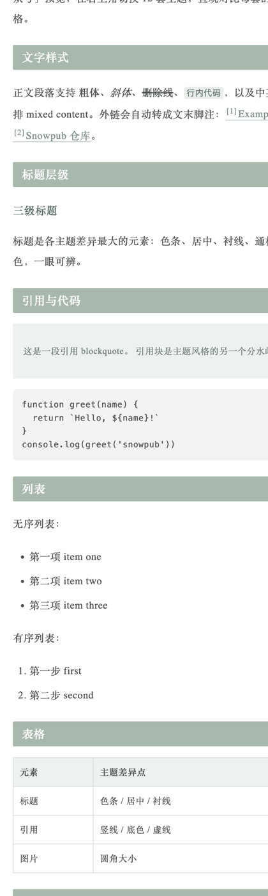
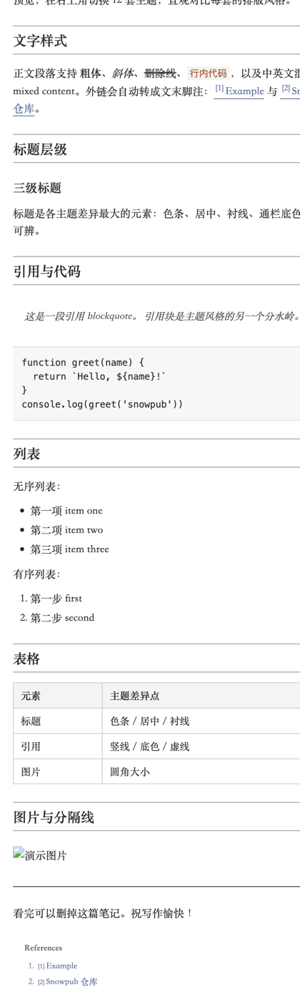

# Snowpub

一款本地优先的微信公众号写作与发布工具，基于 Electron + Vue 3 构建。用 Markdown 写作，实时预览微信样式，一键发布到公众号。

[官网](https://snowpub.wavesnows.com) · [下载](../../releases) · [使用说明](https://snowpub.wavesnows.com/guide/) · [English](README.md)

---



## 功能特性

- **双栏编辑** — 左侧 Markdown（CodeMirror）编辑，右侧微信样式实时预览
- **微信主题** — 内置 12 套排版主题（微信绿 / 科技黑 / 活力橙 / 知乎蓝 / 中国红 / 墨色衬线 / 暖阳米白 / 莫兰迪 / 樱花粉 / 暗夜 / 青竹 / 默认白），随时切换
- **AI 助手** — BYOA 模式侧边面板，调度本机已安装的 agent CLI（Claude Code / OpenCode / OpenClaw，token 自付，Snowpub 不内置模型）。预设动作一键润色选区或全文、起标题、写摘要，或用一段描述生成自定义微信主题并立即应用；回复可回插编辑器光标处
- **公众号发布** — 通过公众号官方 API：保存草稿、发布图文与图片消息（newspic）、查询发布状态
- **粘贴/拖拽传图** — 写作时粘贴或拖入图片，自动存入笔记 `imgs/` 目录（内容哈希命名、去重），发布时统一上传微信
- **智能封面** — 自动取首图为封面，头条 2.35:1 / 次条 1:1 / 原始三档比例走微信 `cover_info`，切换比例免重传
- **图片素材库** — 本地图片上传到公众号素材库，文章封面图选择
- **草稿箱同步** — 拉取 / 删除 / 直接发布公众号已有草稿
- **外链转底部引用** — 自动将外链转为微信友好的底部脚注
- **Git 同步** — 一键推送/拉取到 GitHub 或 Gitee
- **版本历史** — 浏览 Git 提交记录，预览并恢复任意版本
- **全文搜索** — 跨所有笔记即时搜索
- **内置终端** — 快速终端面板（`Ctrl+\``），自动定位到当前笔记所在目录
- **收藏与最近** — 置顶、星标，快速访问常用笔记
- **中英双语** — 界面支持中文和英文切换

## 主题

内置 12 套公众号排版主题，一键切换：

<table>
  <tr>
    <td align="center"><br/><sub><b>微信绿</b></sub></td>
    <td align="center"><br/><sub><b>科技黑</b></sub></td>
    <td align="center"><br/><sub><b>莫兰迪</b></sub></td>
    <td align="center"><br/><sub><b>墨色衬线</b></sub></td>
  </tr>
</table>

另有 8 套：默认白 / 知乎蓝 / 活力橙 / 中国红 / 暖阳米白 / 樱花粉 / 暗夜 / 青竹。

## 安装

从 [Releases](../../releases) 下载最新安装包：

- macOS：`Snowpub_x.x.x_arm64.dmg`（Apple Silicon）· `Snowpub_x.x.x_x64.dmg`（Intel）
- Windows：`Snowpub_x.x.x.exe`

> **macOS 提示：** 应用暂未签名。如果 macOS 提示「已损坏」，在终端执行以下命令后重新打开：
> ```bash
> xattr -cr /Applications/Snowpub.app
> ```

## 从源码构建

```bash
# 需要 Node.js >= 14.17.0
npm install
npm run dev      # 开发模式
npm run build    # 生产构建
```

## 公众号发布配置

1. 打开 **设置 → 公众号**
2. 填入 AppID 和 AppSecret（公众号后台 → 设置 → 开发 → 基本配置 获取）
3. 将本机 IP 加入公众号后台 IP 白名单
4. 点击 **测试连接** 验证
5. 打开 `.md` 笔记 → 工具栏点微信预览图标 → 开始写作
6. 点发布图标 → 填标题 / 作者 / 摘要 / 选封面图 → **保存草稿** → **发布**

> 发布时 Markdown 中的本地图片会自动上传到公众号并替换为公众号 URL。

## AI 助手配置

Snowpub 不内置模型，调度你本机已有的 agent CLI（BYOA）：

1. 至少安装一个：[Claude Code](https://code.claude.com/docs/en/setup)、[OpenCode](https://opencode.ai) 或 [OpenClaw](https://docs.openclaw.ai)
2. 打开右侧栏 **AI 助手** 页签 —— 已检测到的 CLI 会自动列出
3. 选中文字（或用全文）→ 点预设动作：**润色 / 起标题 / 写摘要 / 生成主题**
4. 点回复气泡上的 **插入**，内容即写回编辑器光标处

## Git 同步配置

1. 打开 **设置 → 同步**
2. 选择 GitHub 或 Gitee
3. 填入用户名、仓库名和 Personal Access Token
4. 使用工具栏 Git 按钮手动同步，或在 **调度器** 中配置自动同步

## 交流群

QQ 群：**1121242452**（问题反馈、主题分享、更新通知）· [一键加群](https://qm.qq.com/q/TWpaXmxqcU)

## 捐赠

如果 Snowpub 对你有帮助，欢迎请我喝杯咖啡 ☕

<div align="center">
  <table>
    <tr>
      <td align="center">
        <br/>
        <sub><b>微信支付</b></sub>
      </td>
      <td width="40"></td>
      <td align="center">
        <br/>
        <sub><b>支付宝</b></sub>
      </td>
    </tr>
  </table>
</div>

## 定制服务

需要品牌专属排版主题，或基于 Snowpub 定制功能？我接定制：

- **主题定制**——配色、字体、版式按你的品牌调性交付为可直接使用的主题
- **功能定制**——批量发布、素材管理等，基于开源主干做私有模块，不 fork
- **私有部署 + 年费维护**——含版本更新与优先支持

扫下方微信码，添加时请备注「定制」：

<div align="center">
  <br/>
  <sub><b>微信</b> · 添加备注「定制」</sub>
</div>

## 协议

MIT © [wavesnows](LICENSE)
